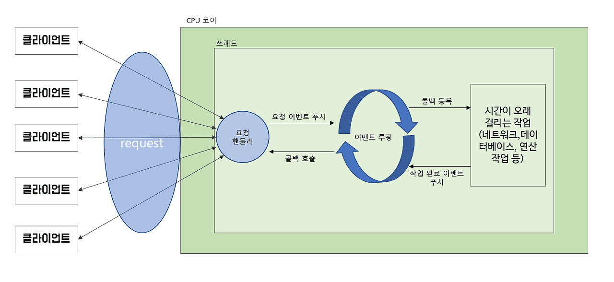
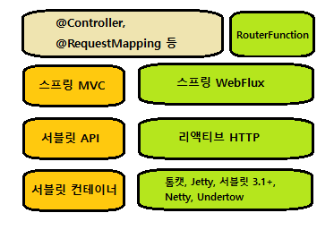

## Webflux
<hr/>

* 서블릿 기반의 웹 프레임워크(= 스프링 MVC)
    * 매 연결마다 하나의 스레드를 사용함.
    * 스레드 블로킹(차단)과 다중 스레드로 수행됨.<br/>
    => 즉, 요청이 처리될 때 스레드 풀에서 작업 스레드를 가져와서 해당 요청을 처리하며, 작업 스레드가 종료될 때까지 요청 스레드는 블로킹된다.
    * 블로킹 웹 프레임워크 : 요청량의 증가에 따른 확장이 어려움. 처리가 느린 작업 스레드(해당 작업 스레드가 풀로 반환되어 또 다른 요청 처리를 준비하는데 더 많은 시간이 걸림)
* 비동기 웹 프레임워크(= 스프링 WebFlux)
    * 더 적은 수의 스레드(CPU 코어 당 하나)로 더 높은 확장성
    
    * 이벤트 루핑(event looping) 기법 적용 : 한 스레드당 많은 요청을 처리할 수 있어서 한 연결당 소요 비용이 더 경제적임.
    * 이벤트 루프에서는 모든 것이 이벤트로 처리됨 (집중적인 작업(ex)DB연결, 네트워크 작업)의 콜백&요청)
    * 비용이 드는 작업이 필요할 경우, 이벤트 루프는 해당 작업의 콜백(callback)을 등록하여 병행으로 수행되게 하고 다른 이벤트 처리로 넘어감. + 그리고 작업이 완료될 때 이것 역시 요청과 동일하게 이벤트로 처리됨.
    * 결과 : 비동기 웹 프레임워크는 소수의 스레드로 많은 요청을 처리할 수 있어서 스레드 관리 부담이 줄어들고 확장이 용이함.

<br/><br/>

### 스프링 WebFlux 개요
* 스프링 WebFlux란 : 리액티브 프로그래밍 모델을 스프링 MVC에 억지로 집어넣는 대신 가능한 많은 것을 스프링 MVC로부터 가져와서 별도의 리액티브 웹 프레임워크를 만들기로 한것의 산물

    * 스프링 MVC : 실행 시에 톰캣과 같은 서블릿 컨테이너가 필요한 자바 서블릿 API의 상위 계층에 위치함.
* 스프링 WebFlux : 새로운 웹 프레임워크로 리액티브 웹 애플리케이션을 지원함.(스프링 MVC의 많은 핵심 컴포넌트를 공유함.)
    * 서블릿 API와 연계되지 않음 => 따라서 리액티브 버전인 리액티브 HTTP API의 상위 계층에 위치함.
    * 서블릿 컨테이너를 필요로 하지 x : 대신에 블로킹이 없는 어떤 웹 컨테이너에서도 실행될 수 있다.
        * ex) Netty, Undertow, 톰캣, Jetty
    * 의존성 : <code>implementation 'org.springframework.boot:spring-boot-starter-webflux'</code>
    * 기본적인 내장 서버 : Netty
        * Netty : 비동기적인 이벤트 중심의 서버
    * 스프링 WebFlux의 컨트롤러 메서드는 도메인 타입이나 컬렉션 대신 **Mono나 Flux**같은 리액티브 타입을 인자로 받거나 반환한다. 또한, 스프링 WebFlux 컨트롤러는 Observable, Single, Completable과같은 RxJava 타입도 처리할 수 있음.
* @Controller, @RequestMapping : 스프링 MVC와 스프링 WebFlux 간의 공통적인 컴포넌트
* RouterFunction : 애노테이션을 사용하는 대신 **함수형 프로그래밍 패러다임**으로 컨트롤러를 정의하는 대안 프로그래밍 모델
> **리액티브 스프링 MVC**
> * 스프링 WebFlux 컨트롤러가 Mono나 Flux 같은 리액티브 타입을 반환함.
> * 스프링 MVC의 컨트롤러도 Mono나 Flux를 반환할 수 있음.
> * 차이점 : 그런 타입들이 사용되는 방법
    >   * 스프링 WebFlux : 요청이 이벤트 루프로 처리되는 진정한 리액티브 웹 프레임워크
>   * 스프링 MVC : 다중 스레드에 의존하여 다수의 요청을 처리하는 서블릿 기반 웹 프레임워크

* 리액티브 웹 프레임워크의 장점을 극대화시키는 방법 : 엔드 - to - 엔드 리액티브 스택 구조
    * 클라이언트 <--(요청/응답)--> WebFlux 컨트롤러 <--(Flux/Mono)--> 서비스 <--(Flux/Mono)--> 리퍼지터리 <--(데이터 스트림)--> DB

<br/><br/>

### WebClient - 리액티브 API 통신
* WebClient : 리액티브 대안으로 <u>**외부 API로 요청할 때 리액티브 타입의 전송과 수신**</u>을 모두함.
    * 다수의 메서드로 서로 다른 종류의 요청 처리가 아닌, <u>WebClient는 요청을 나타내고 전송하게 해주는 빌더 방식의 인터페이스를 사용한다.</u>
    * WebClient를 사용하는 일반적인 패턴
        1. WebClient의 인스턴스를 생성(또는 WebClient 빈을 주입함)
        2. 요청을 전송할 HTTP 메서드를 지정함
        3. 요청에 필요한 URI와 헤더를 지정함.
        4. 요청 제출
        5. 응답을 사용(소비)함.

<br/><br/>
### 리액티브 웹 보안
    ```java
    // 스프링 WebFlux의 스프링 시큐리티 구성
    @Configuration
    @EnableWebFluxSecurity
    public class SecurityConfig {
        @Bean
        public SecurityWebFilterChain securityWebFilterChain(ServerHttpSecurity httpSecurity){
            httpSecurity
                .authorizeExchange(exchanges -> exchanges
                        .pathMatchers("/design","/orders").hasAuthority("USER")
                        .anyExchange().permitAll()
                );
            return httpSecurity.build();
        }
    }
    ```
* <code>WebSecurityConfigurerAdapter</code>의 서브 클래스 x => configure() 오버라이딩 x
* <code>SecurityWebFilterChain</code> 빈 선언
* HttpSecurity 객체 대신 ServerHttpSecurity 객체를 사용해 구성을 선언함.<br/>
  => ServerHttpSecurity : HttpSecurity의 리액티브 버전

##### 명세
* 스프링 WebFlux의 보안 구성 시(명세) :
    * configure() 메서드를 오버라이딩하지 않고 대신 ReactiveUserDetailsService 빈을 선언함. <br/>
      => UserDetailssService의 리액티브 버전이며, UserDtailsService처럼 하나의 메서드만 구현하면 됨. <br/>
      => 특히, findByUsername() 메서드는 UserDetails 객체 대신 Mono&lt;userDetails&gt;를 반환함. <br/>
      => 따라서 Mono 타입에 사용 가능한 오퍼레이션들(ex.map())을 연쇄적으로 호출할 수 있음.
    ```java
    @Service
    public ReactiveUserDetailsService userDetailsService(UserRepository userRepository){
        return new ReactiveUserDetailsService() {
            @Override
            public Mono<UserDetails> findByUsername(String username) {
                return userRepository.findByUsername(username)
                        .map(user -> { // 람다로 전달하여 호출
                            return user.toUserDetails(); // 반환 타입 : Mono<UserDetails>
                        });
            }
        };
    }
    ```
    * 인자로 전달된 UserRepository를 사용하기 위해 ReactiveUserDetailsService 빈이 선언됨.

<br/><br/>

### 적용
1. 컨트롤러에서 적용하기(애노테이션 사용 o) : java/com/example/webflux/OrderController.java
2. 핸들러로 적용하기(함수형 프로그래밍)(애노테이션 사용 x) : java/com/example/webflux/RouterFunctionConfig.java
3. WebTestClient를 통해 테스트 해보기 : java/com/example/webflux/OrderControllerTest_Server.java
4. REST API를 리액티브하게 사용하기 - WebClient : 